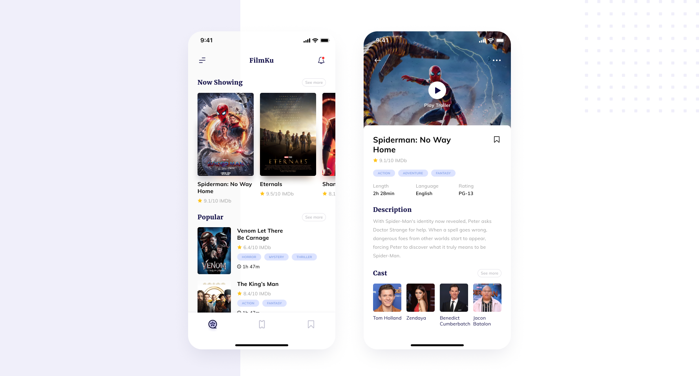

# FilmKu: Movie Tracking and Streaming App

**FilmKu** is a mobile application designed for movie enthusiasts to discover upcoming and popular movies, view detailed information, and watch movie trailers. The app integrates with The Movie DB API to deliver the latest movie data, providing an intuitive UI/UX for a seamless user experience.

## Features

- **Upcoming Movies**: View a list of upcoming movie releases.
- **Popular Movies**: Explore a curated list of the most popular films.
- **Movie Details**: Dive into detailed movie information including ratings, overviews, and trailers.
- **Movie Trailers**: Watch movie trailers directly from the app with an integrated video player.

## Tech Stack

- **Flutter**: Mobile development framework for building a cross-platform app.
- **Riverpod**: Used for state management to ensure a scalable and efficient state handling.
- **Clean Architecture (Feature-First)**: Ensures maintainability and ease of testing by separating concerns in a structured way.
- **The Movie DB API**: Provides movie data for upcoming, popular movies, and movie details.

## Screenshots


*App Cover Image*

## Installation

To run the app locally, clone this repository and follow the steps below:

1. **Clone the repository**

    ```bash
    git clone https://github.com/AzharRaeisi/movie_app.git
    ```

2. **Install dependencies**  
    Navigate to the project folder and install the dependencies:

    ```bash
    cd movie_app
    flutter pub get
    ```

3. **Run the app**  
    To run the app on your preferred emulator or device:

    ```bash
    flutter run
    ```

## Figma Design

Check out the original design on [Figma](https://www.figma.com/design/eExfxf9Qz0FsMuvC58SPVY/Movie-Mobile-App-UI-Design-(Community)?node-id=0-1&p=f&t=zlzv4HJdmCZr2G1Q-0) for a comprehensive look at the UI/UX design of **FilmKu**.

## API Integration

The app interacts with The Movie DB API to fetch data like:

- Popular movies
- Upcoming movies
- Movie details (like ratings, synopsis, etc.)
- Movie trailers

Make sure to get your own API key from [The Movie DB API](https://www.themoviedb.org/settings/api) to use this app.

## Contributing

Feel free to fork this repository, submit issues or pull requests. Contributions and ideas are always welcome!

## License

This project is open-source and available under the [MIT License](LICENSE).

## Acknowledgments

- The Movie DB API for providing movie data.
- Figma for creating the design.
